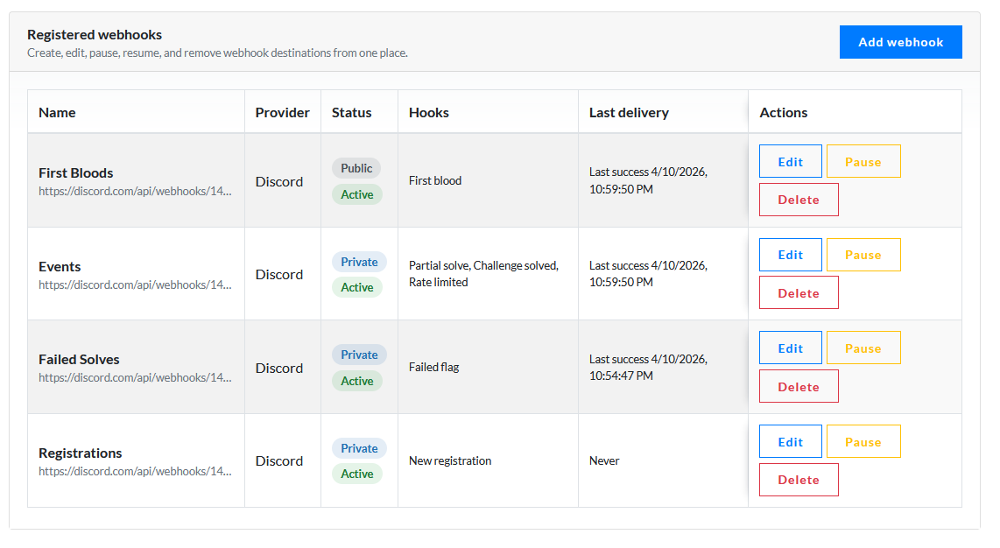
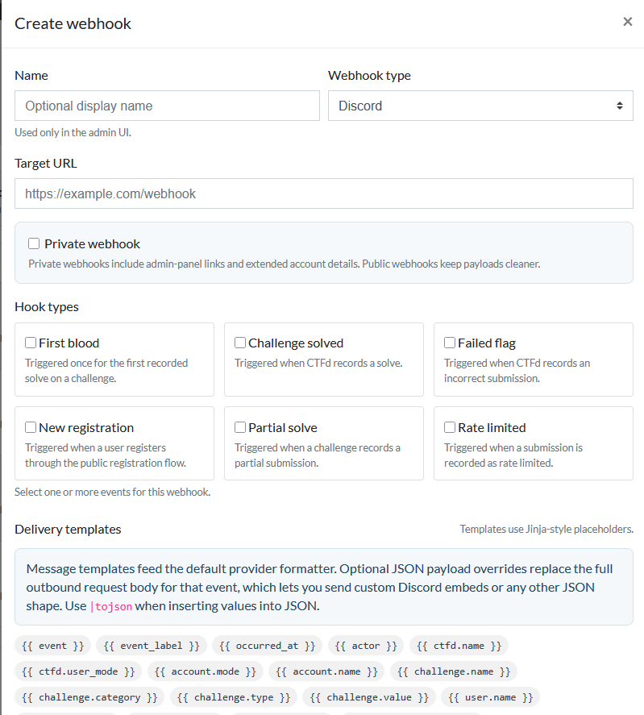
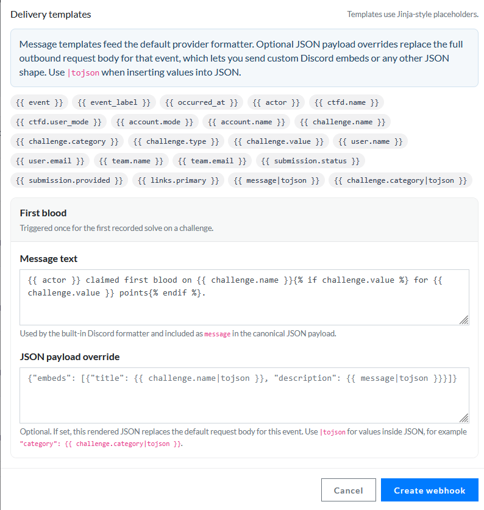

# ctfd-plugin-webhooks

<p align="center">
  
</p>

Standalone CTFd plugin for managing outbound webhooks for challenge activity and user registrations without touching core CTFd. It gives admins one place to register destinations, choose event subscriptions, customize messages, and monitor recent delivery status.

## Highlights

- Dedicated admin page at `/admin/plugins/ctfd-plugin-webhooks`
- Multiple webhook destinations with create, edit, delete, pause, and resume actions
- Public/private delivery modes for clean public payloads or richer internal moderation context
- Per-webhook event subscriptions with support for multiple hook types
- Per-event message templates plus optional full JSON payload overrides
- Built-in providers for `discord` and `generic_json`
- Delivery status tracking with last attempt, last success, and last error visibility
- Compatible with replicated CTFd instances (all instances must have the plugin)

## Admin Experience

Open the plugin from the admin `Plugins` dropdown or go directly to:

```text
/admin/plugins/ctfd-plugin-webhooks
```

| Register webhook destinations | Customize event templates |
| --- | --- |
|  |  |

Each webhook can store:

- An optional display name
- A provider type
- A target URL
- Public/private visibility
- One or more subscribed hooks
- A message template for each selected hook
- An optional JSON payload override for each selected hook
- Pause/resume state
- Last delivery status

## Supported Hooks

| Hook | Trigger |
| --- | --- |
| `first_blood` | First recorded solve on a challenge |
| `challenge_solved` | A correct submission is recorded |
| `failed_flag` | An incorrect submission is recorded |
| `new_registration` | A user registers through the public registration flow |
| `challenge_partial` | A partial submission is recorded |
| `rate_limited` | A submission is recorded as rate-limited |

## Providers

| Provider | Behavior |
| --- | --- |
| `discord` | Sends a formatted embed with event-specific text, colors, and contextual fields |
| `generic_json` | Sends the plugin's canonical JSON payload shape for downstream automation |

## Compatibility

Challenge activity hooks are emitted from the standard CTFd persistence layer by observing `Solves`, `Fails`, `Partials`, and `Ratelimiteds`. Challenge events therefore continue to work for plugin-provided challenge types as long as they record normal CTFd submission rows.

`new_registration` is scoped to the public registration flow. Admin-created users and import paths are intentionally ignored.

## Payloads

### Generic JSON

The `generic_json` provider sends the plugin's canonical payload shape. Example fields:

```json
{
  "event": "challenge_solved",
  "occurred_at": "2026-04-10T19:42:00Z",
  "ctfd": {
    "name": "Example CTF",
    "user_mode": "teams"
  },
  "account": {
    "mode": "teams",
    "id": 4,
    "name": "blue-team"
  },
  "user": {
    "id": 7,
    "name": "alice",
    "email": "alice@example.com",
    "affiliation": null,
    "country": null
  },
  "team": {
    "id": 4,
    "name": "blue-team",
    "email": "team@example.com",
    "affiliation": null,
    "country": null
  },
  "challenge": {
    "id": 12,
    "name": "Warmup",
    "category": "web",
    "type": "standard",
    "value": 100,
    "state": "visible"
  },
  "submission": {
    "id": 91,
    "status": "correct",
    "date": "2026-04-10T19:42:00Z"
  }
}
```

Raw flag submissions and IP addresses are intentionally excluded.

For public webhooks, account payloads stay minimal. For private webhooks, the payload also includes extended account details and admin-panel links for the related challenge, user, team, and plugin page when available.

### Discord

The `discord` provider sends a single embed with a cleaner event title, event-specific summary text, color coding, and selected context fields. Private webhooks also include direct admin URLs so moderators can jump straight into CTFd.

## Templates

Each selected hook can define its own message template in the admin modal. These templates use Jinja-style placeholders.

Common values include:

- `{{ event }}`
- `{{ event_label }}`
- `{{ actor }}`
- `{{ ctfd.name }}`
- `{{ challenge.name }}`
- `{{ challenge.category }}`
- `{{ challenge.type }}`
- `{{ challenge.value }}`
- `{{ user.name }}`
- `{{ team.name }}`
- `{{ submission.status }}`
- `{{ submission.provided }}`
- `{{ links.primary }}`

When you need full control over the request body, set a JSON payload override for the event. The rendered output must be valid JSON and replaces the provider's default payload entirely. This is the path to custom Discord embeds or arbitrary webhook bodies.

Use `|tojson` when inserting dynamic values into JSON templates. Example:

```json
{
  "embeds": [
    {
      "title": {{ challenge.name|tojson }},
      "description": {{ message|tojson }},
      "fields": [
        {
          "name": "Category",
          "value": {{ challenge.category|tojson }}
        }
      ]
    }
  ]
}
```

The rendered result is stored in the outgoing payload as `message`. Discord uses that value as the embed body, and `generic_json` includes it in the canonical JSON payload.

## Delivery Semantics

- Delivery is synchronous and best-effort.
- The original CTFd request is never failed because of a webhook delivery error.
- No retries or background queueing are implemented in this version.

## Tests

Run the plugin-local tests either from the plugin directory:

```bash
pytest tests
```
